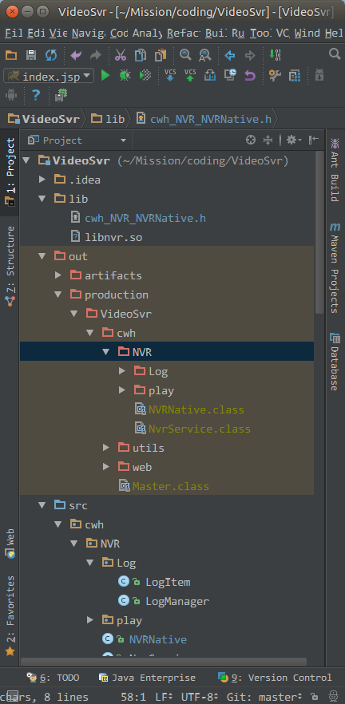

# JNI

## **javah**\(2016-1-15\)

使用javah可以自动从java文件生成jni头文件，

> 用法：javah \[选项\] &lt;类&gt;
>
> 其中 \[选项\] 包括：
>
> -help 输出此帮助消息并退出
>
> -classpath &lt;路径&gt; 用于装入类的路径
>
> -bootclasspath &lt;路径&gt; 用于装入引导类的路径
>
> -d &lt;目录&gt; 输出目录
>
> -o &lt;文件&gt; 输出文件（只能使用 -d 或 -o 中的一个）
>
> -jni 生成 JNI样式的头文件（默认）
>
> -version 输出版本信息
>
> -verbose 启用详细输出
>
> -force 始终写入输出文件

## Example：

工程结构如下： 

执行：

```text
javah -d lib -classpath out/production/VideoSvr -jni cwh.NVR.NVRNative
```

关键在于找到正确的classpath，注意-jni 类名要放在最后面写，否则会把-jni后面的东西都当做类名解析的。

