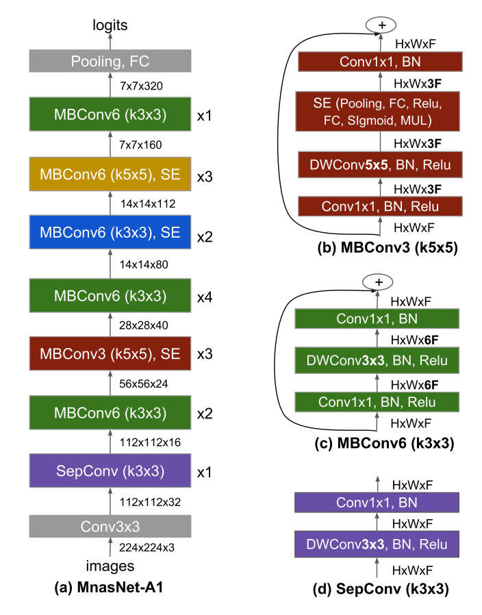
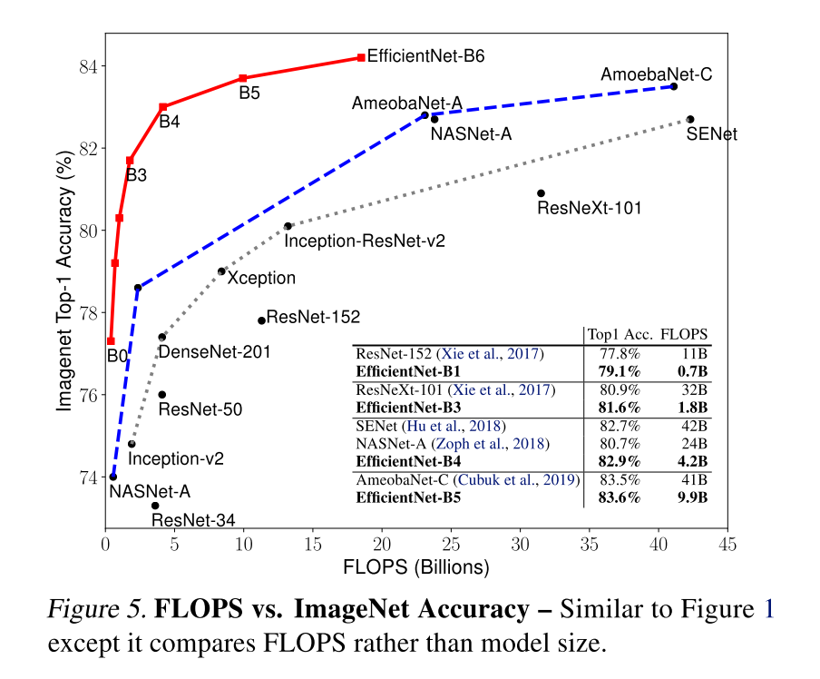

# 分类网络最新进展
## Self-training with Noisy Student improves ImageNet classification

> CVPR2020

### Method
- 在有标签数据上训练Teacher,在无标签数据上预测伪标签
- 用有标签数据和伪标签数据从头训练一个Student模型，Student模型
- 把Student当成Teacher，迭代，效果最好的是迭代三次

特别的地方在于：
- Student比Teacher大，多了Dropout和stochastic depth(model noise)
- 训练数据加Data augumentation（data noise）
- 一些trick：
  - Teacher网络置信度低的，不会用于训练；
  - ImageNet每个类的图像数量差不多，因此带伪标签的unlabel data也在类别上做了平衡，数量多的类只保存一部分，数量少的类多复制几份

### 效果
感觉其实这些操作平平无奇，效果比有监督的EfficientNet-L2（480M，85.5%）提升了一点：（480M，88.7%）

## Meta Pseudo Labels
### Motivation
使用伪标签无监督学习的方法，因为伪标签可能是错的，所以Student不能超越Teacher，如果能让Teacher在过程中也得到训练，输出更好的标签，Student就有希望输出更好的结果。

### Method
- 在有标签数据上先训练一个Teacher，在无标签数据上预测伪标签
- 用伪标签数据训练Student
- Student在有标签数据上测试，得到Loss
- Teacher根据Student在有标签数据上的Loss，对自身权重进行修正（关键就在于如何修正）

### Detail
假如用伪标签方案训练Student，那么训练目标可以这样表示：
$$\theta_{S}^PL = argmin_{\theta_S} L_u(\theta_T, \theta_S)$$

其中，$$L_u(\theta_T, \theta_S) = E_{x_u}[CE(T(x_u; \theta_T), S(x_u; \theta_S))]$$

如果根据Student在有标签数据集上的表现，优化Teacher，那这个目标可以表示为：$$ min_{\theta_T} L_l (\theta_{S}^{PL}(\theta_T))$$

其中，$$\theta_{S}^{PL}(\theta_T)$$就是伪标签方案下，在Teacher网络的参数$$\theta_T$$下，优化出的最优Student参数，即$$argmin_{\theta_S} L_u(\theta_T, \theta_S)$$

所以问题就在于如何解这个优化问题：$$ min_{\theta_T} L_l (\theta_{S}^{PL}(\theta_T))$$，

首先$$\theta_{S}^{PL}(\theta_T)$$可以通过梯度下降法迭代得到，但它是一个多步的优化过程才能得到的结果，我们用单步优化的结果来近似：$$\theta_{S}^{PL}(\theta_T)=\theta_S - \eta_S * \triangledown_{\theta_S}L_u(\theta_T, \theta_S)$$，那么优化目标就变成了：$$ min_{\theta_T} L_l (\theta_S - \eta_S * \triangledown_{\theta_S}L_u(\theta_T, \theta_S))$$;

那么每在伪标签数据上更新一次Student，就可以在有标签数据上算出Teacher的权重更新量，对Teacher进行更新：$$\theta_T=\theta_T-\eta_T\triangledown_{\theta_T} L_l (\theta_S - \eta_S * \triangledown_{\theta_S}L_u(\theta_T, \theta_S))$$，其中两个梯度都是对CE求导，因此这个更新量可以很容易地求出来；

## 辅助Loss
单独用上面的方法已经可以得到不错的结果了，但如果在训练的时候，配合其他Loss训练，效果更佳；文中提及了unsupervised domain adaption的一些方法，可以在论文附录查询到。

### 效果
在ImageNet上首次干到了90.2%的top1 ACC

## EfficientNet: Rethinking model scaling for convolutional neural networks
### Motivation
这篇论文我更愿意称其为实验报告，研究了如何扩展网络的input resolution, width(channel数)， depth(layer数)，才能得到性价比最高的网络

### Observation
这篇文章基于两个observation来调整网络规模：

- 增加输入/宽度/深度，都能提高模型效果，但存在边际效应，加的太多提升不明显；
- 因此，与其把多出来的算力堆在单个维度上，不如同时扩张三个维度；

### Method
具体的扩张策略如下：
- 假设depth变成$$\alpha$$倍，那么FLOPS会变为$$\alpha$$倍，假设width(卷积的输入和输出通道数)变为$$\beta$$倍，那么FLOPS会变为$$\beta^2$$倍，假设输入宽度变为$$\gamma$$，那么FLOPS变为$$\gamma^2$$；
- 我们希望调整参数后，FLOPS变为$$2^{\phi}$$，那么就要求$$\alpha * \beta^2 * \gamma^2=2$$，因此具体的调整策略就变成了：
- depth: $$d=\alpha^\phi$$
- width: $$w=\beta^\phi$$
- resolution: $$r = \gamma^\phi$$
- st: $$\alpha * \beta^2 * \gamma^2=2$$, $$\alpha>1, \beta>1, \gamma>1$$

### Network
在各种基础网络上试了这个策略，发现Mnas上改出来的最好，网络结构大概长这样，但是size会有所不同，比如EfficientNet-B0就是

### Result
